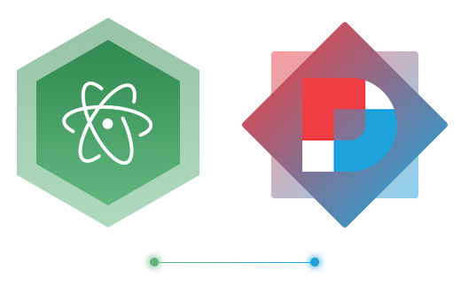

# ATOM-DNN Snippets

Snippets + AutoCompletions to add common DNN ( **DotNetNuke CMS** ) tags when building template skins in Atom Editor. Feel free to add your own.

**NOTE :** This package is still in heavy alpha stage. Will be adding more skin tags along the way.

